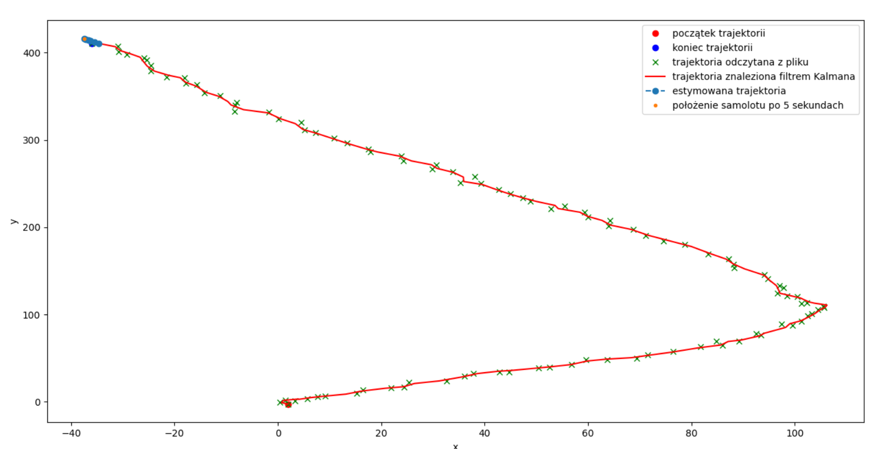
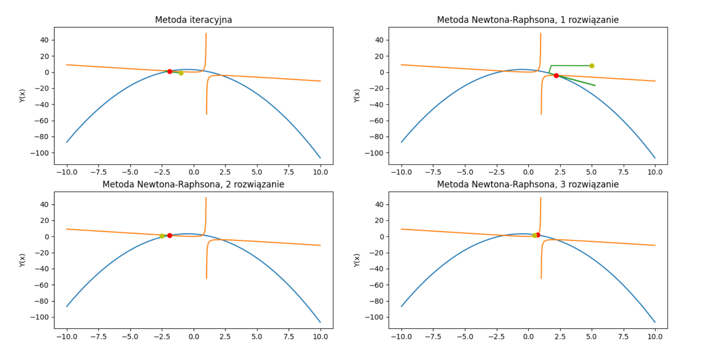

# Numerical-Methods
Set many different scripts using numpy, matplotlib and scipy

Examles:
* Newton polynomial interpolation and Spline interpolation

* Kalman filter

* Runge-Kutty method

* Newton Raphson method

